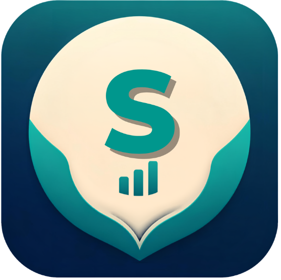

<p align="center">
  
</p>

<h1 align="center">Sakto</h1>

<p align="center">
  <strong>An offline personal finance tracker</strong> for accounts, income, expenses,<br />
  credits, lent money, reports, and end-of-month forecasting.
</p>

<p align="center">
  
  
  
  
  
</p>

<p align="center">
  <a href="#features">Features</a> ·
  <a href="#download-and-install">Download</a> ·
  <a href="#tech-stack">Tech stack</a> ·
  <a href="#quick-start">Quick start</a> ·
  <a href="#developer">Developer</a>
</p>

---

## Overview

Sakto is a private, offline-first money tracker built for Android with Flutter. Financial records are stored in a local SQLite database on the device: there is no account, server, cloud sync, or internet requirement.

| Area | What it covers |
|------|----------------|
| **Accounts** | Cash, e-wallets, bank accounts, and cards with live balances |
| **Transactions** | Income and expense records with categories, dates, and notes |
| **Credits** | Cash loans and installment purchases with payment progress |
| **Lent money** | Amounts owed to you, due states, repayment, and reminders |
| **Planning** | Recurring income and projected end-of-month balance |
| **Reports** | Weekly, monthly, or custom date-range summaries |

> Uninstalling the app deletes its local database unless you create and keep a JSON backup first.

---

## Features

- **Offline by default** — every core feature works without an internet connection
- **Multiple accounts** — maintain separate cash, bank, card, and e-wallet balances
- **Atomic transactions** — adding income or expenses updates the selected account automatically
- **Credit tracking** — principal, payment schedule, interest, remaining balance, and payment history
- **Lent-money ledger** — upcoming, due-today, overdue, and paid states
- **Cash-flow forecast** — recurring income, expected repayments, and known upcoming bills
- **Date-range reports** — spent, added, net total, and transaction history
- **Local reminders** — due and overdue repayment notifications
- **Portable backup** — export all local records to a JSON file
- **Private by design** — no authentication, analytics, backend, or cloud database

---

## Download and install

Download the latest Android APK from the [GitHub Releases page](https://github.com/diobrandedd/sakto-finance/releases/latest).

1. On your Android phone, download `sakto-v1.0.0.apk`.
2. Open the downloaded file.
3. Allow **Install unknown apps** for your browser or file manager when Android asks.
4. Tap **Install**.

Future releases signed by the same developer key can be installed over the existing app while preserving local data. Creating a backup before any update is still recommended.

---

## Tech stack

| Layer | Stack |
|-------|-------|
| **Application** | Flutter 3.44, Dart 3.12, Material 3 |
| **Database** | SQLite through Drift reactive queries |
| **State** | Riverpod |
| **Charts** | fl_chart |
| **Notifications** | flutter_local_notifications |
| **Formatting** | intl, Google Fonts |
| **Platforms** | Android; iOS project scaffold included |

---

## Project layout

```text
money-tracker/
├── android/                 # Android application and release configuration
├── assets/                  # Sakto launcher artwork
├── ios/                     # iOS project scaffold
├── lib/
│   ├── database/            # Drift schema, queries, and atomic writes
│   ├── services/            # Notifications and JSON backup
│   ├── theme/               # Sakto colors and typography
│   ├── app.dart             # Screens, navigation, and providers
│   └── main.dart            # Application entry point
├── test/                    # Flutter tests
└── pubspec.yaml             # Dependencies and app metadata
```

---

## Quick start

### Prerequisites

- Flutter 3.44 or newer
- Android Studio with Android SDK and an emulator
- Dart SDK bundled with Flutter

### Run locally

```powershell
git clone https://github.com/diobrandedd/sakto-finance.git
cd sakto-finance
flutter pub get
dart run build_runner build
flutter run
```

### Verify

```powershell
flutter analyze
flutter test
flutter build apk --debug
```

Release signing credentials are intentionally excluded from the repository. Create your own Android keystore before producing a differently signed release build.

---

## Data and privacy

- Records remain in the device's local application storage.
- Sakto does not transmit financial information to a server.
- A fresh installation starts with an empty database.
- App data normally remains during an in-place update, but is removed when the app is uninstalled or its storage is cleared.
- JSON exports may contain private financial data and should be stored securely.

---

## Developer

<p align="center">
  <strong>Noli M Fin III</strong><br />
  Full-stack developer · Sakto<br />
  <a href="https://www.linkedin.com/in/noli-fin-5b295a276/">LinkedIn</a>
  ·
  <a href="https://github.com/diobrandedd">GitHub</a>
</p>

Designed and developed as a private, practical offline finance tool.

---

## License / use

Personal project by Noli M Fin III. All rights reserved.

Do not commit Android signing keys, `key.properties`, credentials, or private financial exports.
